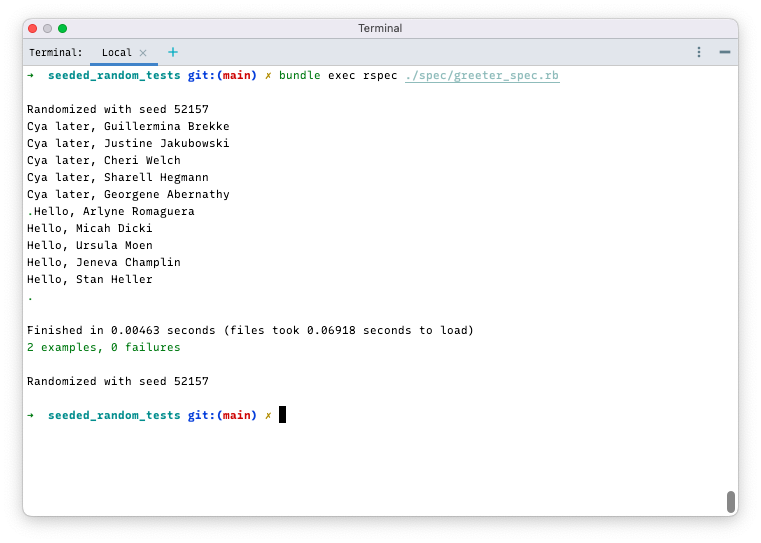
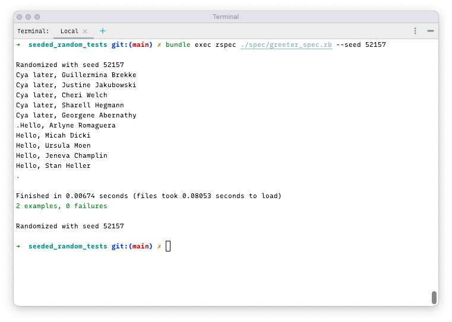
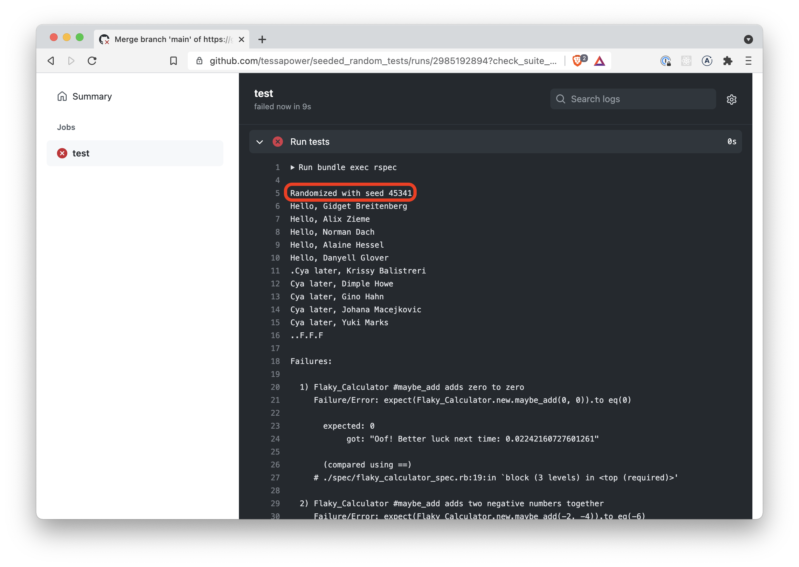
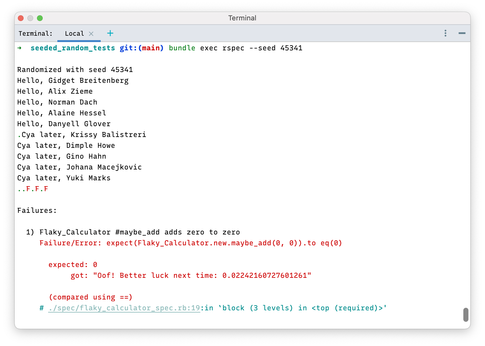

# Seeded Random Tests

[](https://github.com/tessapower/seeded_random_tests/actions/workflows/run-tests.yml) [](https://github.com/tessapower/seeded_random_tests/actions/workflows/rerun-tests-with-seed.yml)

Repo for a talk I gave on randomized testing using RSpec and FFaker. **Click the failing tests above for live examples!**

See also: [tessapower/my-pseudo-rand](https://github.com/tessapower/my-pseudo-rand).

Sometimes tests that make use of random data fail. In those cases, we want to be able reproduce the tests that failed
with the same data. This can be problematic if we're using a random data generator that generates new data on-the-fly.
Each time we run tests, *new* random data is generated, so we cannot simply rerun the tests that failed. Not being able
to reproduce tests makes them non-deterministic, which can lead to many an unproductive hour tracking down Heisenbugs.

Still, we want to be able to benefit from using a random data generator to test our application, while also being
able to reproduce tests if something fails. In other words, we want our random testing to be deterministic.

The good news is that random data generators are not truly random—they are *pseudo-random*—and we can easily reproduce
tests to use the same random data in the exact same order. 

What follows is a short and sweet demonstration of how to set up our testrunner
[RSpec](https://github.com/tessapower/seeded_random_tests#rspec) with
[FFaker](https://github.com/tessapower/seeded_random_tests#ffaker) to achieve just that.

---

### A Brief & Important Sidenote: Random vs. Pseudo-Random

Simply put, a Random **Data** Generator works by using a Random **Number** Generator (RNG) to decide what value to
return next. Given a seed (starting value), an RNG will give you a sequence of random numbers.

This key insight here is: the sequence of numbers is not random, but *pseudo-random*, and the outcome of a
deterministic program.

Though it's impossible for us to distinguish random numbers from pseudo-random numbers, we can reliably reproduce the
latter given we know the seed that was used to start the sequence.

For a better understanding and intuition on Pseudo-Random Number Generators, take a look at a working example
[here](https://github.com/tessapower/my-pseudo-rand).

---

## Installation

**Prerequisites:** Ruby (3.3)

Clone or fork this repository.

```bash
# Navigate to the root directory
cd ./seeded_random_tests
# Install the required Gems
bundle install
```

## Configuration

After adding `RSpec` to a project, running `rspec --init` generates a boilerplate `RSpec` configuration file called
`spec_helper.rb`. We need to uncomment the following line in this file so tests can be run from the command line
with the `--seed` flag and will execute in the exact same order:

```ruby
config.order = :random
Kernel.srand config.seed
```

We also need to add the following lines inside the `Rspec.configure do |config|` block to tell `FFaker` to use the same
seed as `RSpec` and print out the seed once the test suite has finished:

```ruby
config.before(:all)  { FFaker::Random.seed=config.seed }
config.before(:each) { FFaker::Random.reset! }
```

And with that, our tests will return the same data every time we run `Rspec` with the `--seed xxxxx` flag.

## Run the Tests

```bash
# Run all tests
bundle exec rspec

# Run a specific test file
bundle exec rspec ./spec/greeter_spec.rb

# Run a specific test in a specific test file
bundle exec rspec ./spec/greeter_spec.rb:16
```



## Rerun the Same Tests with `--seed`

```bash
bundle exec rspec --seed 52157
```


## Can We Reproduce Tests that were run in a Remote Environment?

**Yes**—copy the seed that appears in the logs of the remote test run (GitHub Actions, CircleCi, Bitrise, etc.):



Run the test command in your terminal with the `--seed xxxxx` flag:


