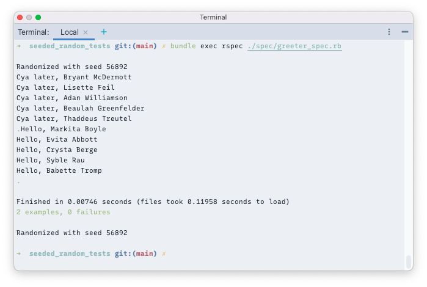
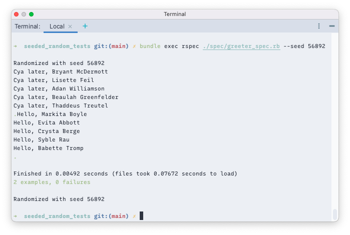

## Seeded Random Tests

### Introduction


### Install

Prerequisites: Ruby (2.7.3), 
```
cd ./seeded_random_tests
bundle install
```

### How to Run the Tests

```bash
bundle exec rspec ./spec/greeter_spec.rb
```


### Rerun using the Seed

```bash
bundle exec rspec ./spec/greeter_spec.rb --seed 56892
```


#### Can I Reproduce Tests Locally That Were Run in a Different Environment?

